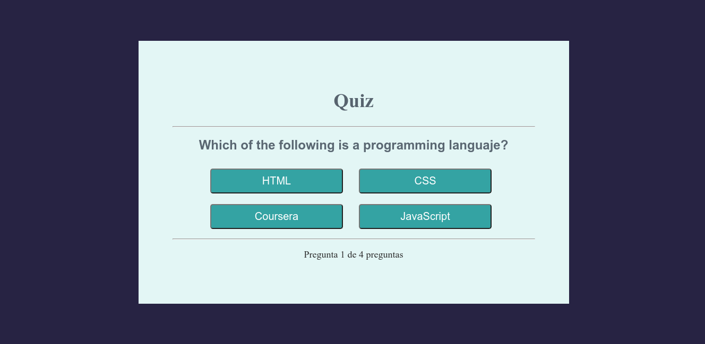

<h1 align="center">Quiz Practice</h1>

   Practice project using OOP concepts in JavaScript.
   This project was thanks to **Fazt** from youtube. 

## Table of Contents

- [Overview](#overview)
- [Built With](#built-with)
- [Features](#features)
- [Contact](#contact)
- [Acknowledgements](#acknowledgements)

<!-- OVERVIEW -->

## Overview

This project was carried out with the objective of practicing and remembering the concepts of OOP in JavaScript. The project is about a small Quiz where some questions are asked.

- What was your experience?
I had a lot of fun using the concepts of OOP, the use of classes and methods is very productive when reusing code. All the interface that is presented to the user is generated through JavaScript.

- What have you learned/improved?
I have managed to strengthen my knowledge in OOP using JavaScript, I have managed to understand how to connect my data and inject it into the graphical interface using classes and methods. 

### Built With

<!-- This section should list any major frameworks that you built your project using. Here are a few examples.-->

- JavaScript
- POO
- Modules
- CSS3
- HTML5

## Features

This is a small application, built in order to strengthen knowledge and discover new knowledge.

## Acknowledgements

- [Mozilla Developer Network](https://developer.mozilla.org/es/)
- [W3-Schools](https://www.w3schools.com/)

## Contact

- GitHub [ @Pierre7Agus ]( https://github.com/Pierre7Agus )
- CodePen [ Pierre7Agus ]( https://codepen.io/pierre7agus/pens/public )
- Twitter [ @agurto_pierre ]( https://twitter.com/@agurto_pierre )